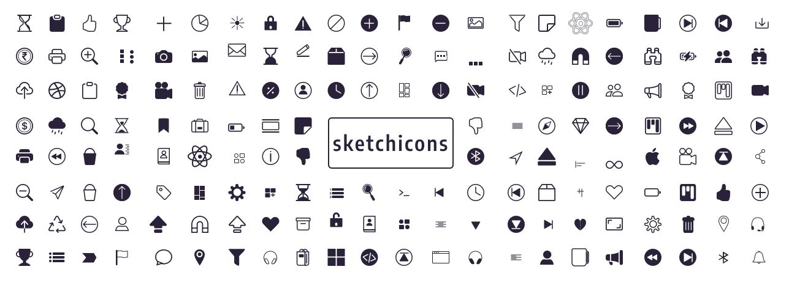

#  Sketch-icons


Sketch-icons is an icon library that makes using icons simple for everyone.


[](https://github.com/chakra-ui/chakra-ui)
[](https://www.npmjs.com/package/sketch-icons)
[](https://www.npmjs.com/package/sketch-icons)
[](https://www.npmjs.com/package/sketch-icons)
[](https://www.npmjs.com/package/sketch-icons)
[](https://www.npmjs.com/package/sketch-icons)
[](https://www.jsdelivr.com/package/gh/garudatechnologydevelopers/Sketch-icons)
[](https://app.netlify.com/sites/sketch-icons/deploys)



## Installation

```bash
npm i sketch-icons
# or
yarn add sketch-icons
```

## Contributing

Please see [CONTRIBUTING GUIDELINES](CONTRIBUTING.md)

## Code of Conduct

Please read the [CODE OF CONDUCT](CODE_OF_CONDUCT.md)

## Learn More

You can learn more in the
[Create React App documentation](https://facebook.github.io/create-react-app/docs/getting-started).

To learn React, check out the [React documentation](https://reactjs.org/).

## Our Top Contributors 
<p align="center"><a href="https://github.com/garudatechnologydevelopers/Sketch-icons/graphs/contributors">
  
</a></p>
